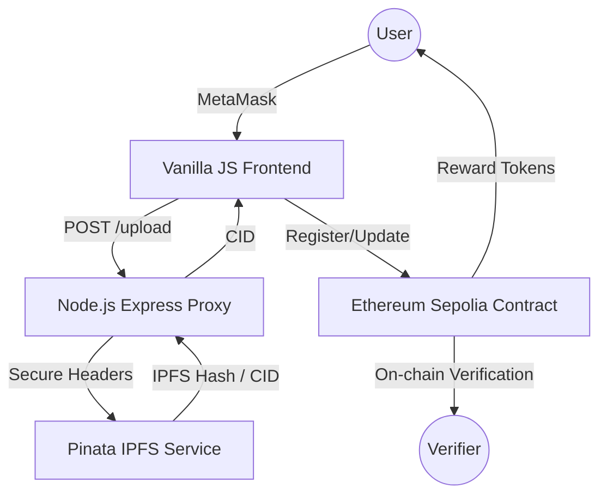

# DIDChain — Decentralized Identity & Reputation System
> **Securing Digital Identity through Blockchain, IPFS, and Soulbound Reputation Layers.**

---

## 📄 0. Abstract

In the modern digital landscape, centralized identity management systems pose significant risks to user privacy, data sovereignty, and security. Data breaches and unauthorized surveillance have highlighted the critical need for a paradigm shift toward **Self-Sovereign Identity (SSI)**. 

**DIDChain** is a production-grade decentralized identity platform designed to empower users with full control over their digital personas. By decoupling identity data from centralized silos, the system utilizes a hybrid architecture of **Ethereum (Sepolia)** for immutable verification and **IPFS (via Pinata)** for decentralized storage. To enhance trust and engagement, DIDChain introduces a **Reputation Scoring System** powered by **Soulbound ERC-20 Tokens (DID)**—non-transferable assets that represent a user's on-chain reliability and history.

The system ensures that no **Personally Identifiable Information (PII)** is ever stored directly on the blockchain; instead, only cryptographic hashes (CIDs) are recorded. This approach maximizes privacy while ensuring tamper-proof verification. The final outcome is a scalable, secure, and user-centric identity framework that mitigates the risks of identity theft and centralized control, providing a robust foundation for the future of Web3 interactions.

---

## 🏗️ 1. Project Overview

**DIDChain** provides a seamless interface for users to register their professional or academic identities on the blockchain. Unlike traditional systems where your data is owned by a corporation, DIDChain ensures that you are the sole owner of your identity. 

### Why Decentralized Identity Matters?
- **Privacy**: You decide what data to share and with whom.
- **Interoperability**: Your identity works across different platforms without needing separate accounts.
- **Security**: No single point of failure; your data is distributed across the IPFS network.
- **Reputation**: Build a verifiable "Trust Score" that follows you globally.

---

## 🚀 2. Key Features

- ✅ **Self-Sovereign Identity (DID)**: Complete ownership of your digital identifier.
- ✅ **Decentralized Storage**: Profile data is stored on IPFS, represented by a permanent CID.
- ✅ **Soulbound Reward Tokens (DID)**: Non-transferable ERC-20 tokens that act as reputation markers.
- ✅ **Trust Score Algorithm**: Real-time on-chain calculation of user reliability.
- ✅ **Secure Backend Proxy**: Protects sensitive Pinata API keys from client-side exposure.
- ✅ **MetaMask Integration**: Secure, one-click authentication and transaction signing.

---

## 🗺️ 3. System Architecture

The project follows a **Hybrid Web3 Architecture** to balance security, privacy, and cost-efficiency.



### Role of Components:
1. **Frontend**: Interactive dashboard for identity management and score viewing.
2. **Backend**: Acts as a security layer to handle IPFS interactions without exposing secrets.
3. **IPFS**: Stores the actual identity JSON (name, college, ID) off-chain.
4. **Blockchain**: Stores only the mapping of `address => CID` and manages the reputation logic.

---

## 🔄 4. System Workflow

### 1. Registration Flow
1. User enters profile details (Name, College, etc.) in the dashboard.
2. Frontend sends data to the **Node.js Backend**.
3. Backend uploads JSON to **Pinata IPFS** and receives a **CID**.
4. Frontend prompts User to sign a transaction calling `registerIdentity(CID)`.
5. Smart contract stores the CID and mints **50 DID** tokens to the user.

### 2. Update Flow
1. User modifies their details.
2. New JSON is pinned to IPFS, generating a new CID.
3. User signs `updateIdentity(newCID)`.
4. Contract updates the pointer and rewards the user with **10 DID** tokens.

### 3. Identity Retrieval Flow
1. Any user/verifier enters an Ethereum address.
2. Frontend calls `getIdentity(address)` to get the CID and active status.
3. Frontend fetches the profile JSON from IPFS and displays it.

---

## 📜 5. Smart Contract Design

The system utilizes two interlinked smart contracts on the Sepolia Testnet.

### `DIDRegistry.sol`
- **Purpose**: The core logic layer for identity management.
- **State**: Stores a mapping of addresses to `Identity` structs (CID, timestamps, active status).
- **Reputation**: Tracks the number of registrations, updates, and revocations for setiap user.

### `DIDToken.sol`
- **Purpose**: A Soulbound ERC-20 token (`DID`) used for reputation.
- **Soulbound Logic**: Overrides the `_update` function to prevent any transfers between addresses.
- **Minting**: Only the Registry contract is authorized to mint tokens as rewards.

### Contract Linking:
- Use `setTokenAddress()` on the Registry to define the reward token.
- Use `setDIDRegistry()` on the Token to authorize the Registry as a minter.

---

## 🧠 6. Reputation Algorithm

The **Trust Score** is a dynamic value between **0 and 100**, calculated directly on the blockchain.

### The Formula:
$$Score = (Registrations \times 10) + (Updates \times 5) - (Revocations \times 15)$$

### Example Calculation:
If a user has **1 Registration**, **2 Updates**, and **0 Revocations**:
- $(1 \times 10) + (2 \times 5) - (0 \times 15) = 20$
- **Total Trust Score**: 20/100

*Note: Revoking an identity carries a heavy penalty to discourage identity cycling or fraud.*

---

## 🛠️ 7. Setup & Installation Guide

### Phase 1: Smart Contracts (Remix)
1. Deploy **DIDToken.sol** on Sepolia and copy the address.
2. Deploy **DIDRegistry.sol** on Sepolia and copy the address.
3. **Link them**:
   - In `DIDRegistry`, call `setTokenAddress(TOKEN_ADDR)`.
   - In `DIDToken`, call `setDIDRegistry(REGISTRY_ADDR)`.

### Phase 2: Backend Configuration
1. Navigate to the `/backend` folder.
2. Install dependencies: `npm install`.
3. Create a `.env` file and add your keys (see Section 8).

### Phase 3: Run the Project
From the **root directory**, run:
```bash
# Install everything
npm run install-all

# Start both Backend (5000) and Frontend (8081)
npm run dev
```

---

## 🔑 8. Environment Variables (`backend/.env`)

| Variable | Description |
|---|---|
| `PINATA_API_KEY` | Your Pinata API Key |
| `PINATA_SECRET_API_KEY` | Your Pinata Secret API Key |
| `RPC_URL` | Sepolia RPC URL (Alchemy/Infura) |
| `DID_REGISTRY_ADDRESS` | Deployed Registry Contract Address |

---

## 📖 9. Usage Guide

1. **Connect Wallet**: Click "Connect Wallet" and switch to Sepolia.
2. **Register**: Fill the form to create your decentralized identity.
3. **Dashboard**: View your **Trust Score** (reputation) and **DID Balance** (tokens) in real-time.
4. **Lookup**: Paste any address in the search bar to verify another user's identity.
5. **Manage**: Update your profile or revoke your identity if necessary.

---

## 🛡️ 10. Security & Privacy

- **No PII on Chain**: We follow GDPR/Privacy principles by only storing IPFS CIDs.
- **Backend Masking**: API keys for storage providers are never stored in the browser.
- **Owner Control**: The `onlyOwner` modifier ensures only you can modify your own identity.
- **Soulbound Integrity**: Tokens cannot be bought or traded, ensuring the Trust Score cannot be manipulated.

---

## 📂 11. Folder Structure

```text
/did-identity
├── backend/            # Express.js Server & IPFS Proxy
├── contracts/          # Solidity Smart Contracts (Registry & Token)
├── frontend/           # Vanilla HTML/CSS/JS Dashboard
├── package.json        # Root automation scripts
└── README.md           # You are here
```

---

## 🔮 12. Future Enhancements

- **Zero-Knowledge Proofs (ZKP)**: Prove you are >18 without revealing your DOB.
- **DAO Governance**: Let the community vote on reputation weights.
- **Identity Badges**: Issue Soulbound NFTs for specific achievements (e.g., "Verified Graduate").
- **Multi-chain Support**: Expand identity to Polygon and Arbitrum.

---

## 📸 13. Screenshots


*(Replace with your actual dashboard screenshot)*

---

## 📄 14. License

This project is licensed under the **MIT License**.

---

**Built with ❤️ by the DIDChain Team.**
